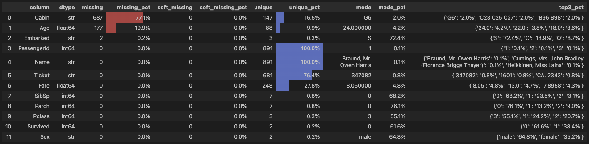
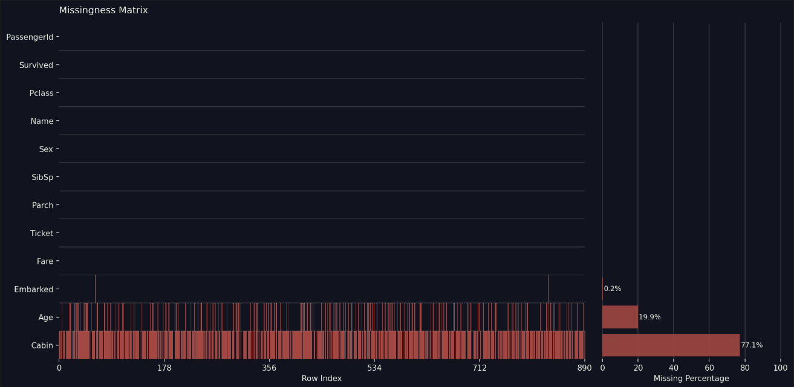
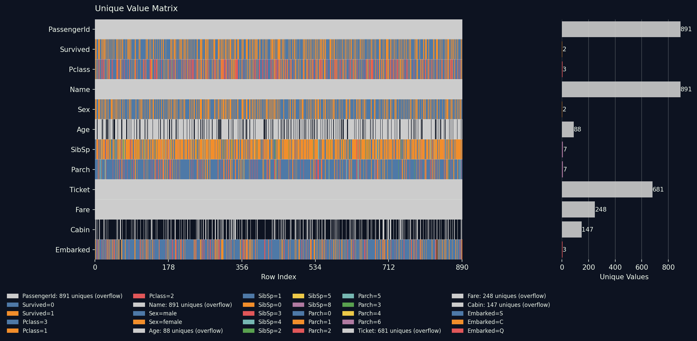

<div align="center">
  
  <h1>dfaudit</h1>
  <p><strong>Know if you can trust your data before you use it.</strong></p>
  <p>A fast, modern data audit tool for pandas DataFrames -- built for analysts who need to assess data reliability, not just explore it.</p>

  [](https://pypi.org/project/dfaudit/)
  [](https://www.python.org/)
  [](LICENSE)
</div>

---

## What is dfaudit?

**dfaudit** is a lightweight Python package for auditing pandas DataFrames. Before you clean, model, or report -- you need to know whether your data is reliable. dfaudit gives you that answer fast.

Think of it as an auditor's first pass: one call to understand how complete, consistent, and trustworthy your data actually is. Missing values, cardinality, dominant categories -- the things that tell you if the data holds up.

## Install

```bash
pip install dfaudit
```

## Quickstart

```python
import pandas as pd
import dfaudit as dfa

df = pd.read_csv("https://raw.githubusercontent.com/pandas-dev/pandas/master/doc/data/titanic.csv")

dfa.overview(df)
dfa.missing_matrix(df)
dfa.unique_matrix(df)
```

## What you get

### `overview(df)` - Column-level data quality table

A styled summary table covering every column at once: dtypes, missing counts and percentages, unique value counts, mode, and top-3 categories - all color coded so problems jump out instantly.



**missing** — standard `NaN` / `None` / `NaT` values pandas considers null.

**soft_missing** — values that are technically non-null but meaningless in practice: empty strings, placeholder text, and numeric sentinel codes commonly used in legacy systems or exports. dfaudit flags these automatically:

- Strings: `""`, `"n/a"`, `"na"`, `"null"`, `"none"`, `"nan"`, `"nil"`, `"-"`, `"--"`, `"?"`, `"unknown"`, `"missing"`, `"not available"`, `"not applicable"`
- Numbers: `-999`, `-9999`, `9999`, `99999`

Missing percentage cells are highlighted red for high missingness, blue for high cardinality.

### `missing_matrix(df)` - Row-level missingness visualization

A matrix plot that shows *where* your data is missing across every row, with a bar chart of missing percentages per column on the right. Spot correlated missingness, systematic gaps, and data loading issues that column-level stats miss entirely.



```python
dfa.missing_matrix(df, style="vivid")
```

### `unique_matrix(df)` - Row-level unique value visualization

A matrix plot that shows the distribution of unique values across every row and column. Low-cardinality columns (≤ 10 unique values) get a distinct color per value — so a binary column like `Sex` renders in two colors, a 3-class column like `Pclass` in three. High-cardinality columns (`Name`, `Ticket`, `PassengerId`) appear in a uniform gray, making it immediately obvious which columns are categorical vs. continuous or near-unique identifiers. A bar chart on the right shows the exact unique value count per column.



```python
dfa.unique_matrix(df)
dfa.unique_matrix(df, style="vivid", max_colors=8)
```

## Why I built this

I work with a lot of different data on a daily basis. For years I carried the same audit snippets from notebook to notebook -- copy, paste, tweak, repeat. At some point I decided to stop doing that and package the most common data audit tasks into something reusable, with visuals I actually want to look at.

dfaudit is what I reach for now at the start of every new dataset. I hope it saves you the same time it saves me.

If you work with modern data and want to contribute -- please do, pull requests are very welcome.

---

<div align="center">
  Made by <a href="https://github.com/ivankmk">Ivan Kumeyko</a> &nbsp;·&nbsp; MIT License
</div>
